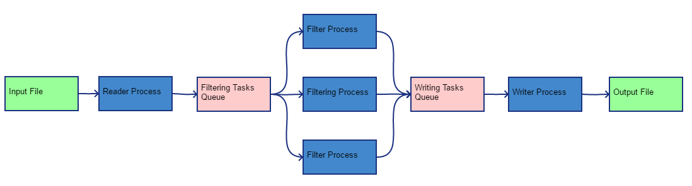

# Multiprocessing IP Cleaner

Data flow in multiprocessing IP cleaner tool.

Where:

* input file - input CSV file;
* Reader process - reads CSV file line by line and adds tasks into queue
for further filtering. All tasks will be grouped into chunks;
* Filtering Tasks Queue - queue with chunks of tasks for filtering;
* Filter Process - set of processes that performs cleaning from sensitive
information and produces chunks of tasks for further writing into
output file;
* Writing Tasks Queue - queue with chunks of tasks for further writing
into output file;
* Writer Process - process that writes data into output file;
* Output File - file with output data.